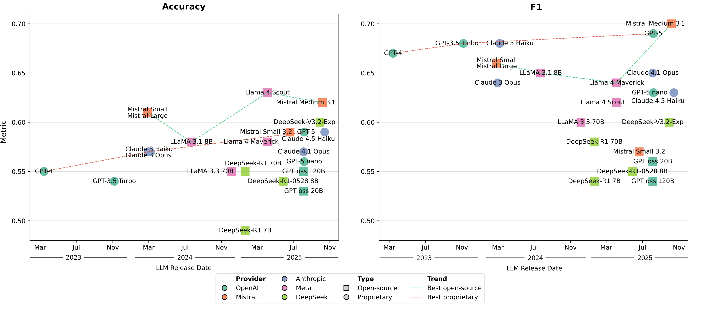

# Emerging Capacity of Large Language Models to Predict Chemical Reaction Yields

## Overview

This repository accompanies the study *“Emerging Capacity of Large Language Models to Predict Chemical Reaction Yields”* and provides:

- Curated reaction yield datasets derived from USPTO and ORD
- Few-shot yield classification using general-purpose LLMs
- Reaction embedding extraction using LLMs
- Supervised ML models trained on LLM embeddings and DRFP fingerprints
- Reproducible scripts and notebooks for all experiments

## Key Contributions

- Systematic evaluation of general-purpose LLMs for reaction yield prediction
- Evidence that few-shot prompting rivals or exceeds specialized chemical models
- Demonstration that LLM embeddings encode yield-relevant chemical information
- Benchmarking across model generations and open vs closed models

## Prerequisites

- For experiments with LLaMA and DeepSeek models [Ollama](https://ollama.com/download) should be installed and running
- Pull a model to use with the library: `ollama pull <model>` e.g. `ollama pull llama3.1:8b`

## Preparation of datasets
The notebooks regarding datasets preparation process can be found in the [datasets_prep_notebooks](./datasets_prep_notebooks) folder. The resulting USPTO-R, USPTO-C, ORD-R and ORD-C datasets as well as USPTO-R based datasets with different train sizes are provided in the [data](./data) folder for your convenience.

## Few-shot classification
The code required to reproduce few-shot classification experiments is provided in the [few_shot_classification_API](./few_shot_classification_API/) (for MistralAI, Anthropic, and OpenAI models) and [few_shot_classification_HF](./few_shot_classification_HF/) (for DeepSeek and MetaAI models) folders.

## Embeddings classification
### Embeddings extraction

The code for extraction of reactions embeddings from text-embedding-3-large, Mistral 7B, and LLaMA-3.1-8B models is provided in [embeddings_generation](./embeddings_generation/) folder.

### Training XGB on DRFPs and LLM embeddings

Scripts for running grid-search and evaluation of XGB models trained on DRFPs and LLM embeddings are provided in the [xgb_drid_search](./xgb_grid_search/) folder.

`python xgb_gs_drfp.py <path_to_smiles_dataset.csv> > result.txt` 
`python xgb_gs_embeddings.py <path_to_llm_embeddings_dataset.csv> <path_to_smiles_dataset.csv> > result.txt`
