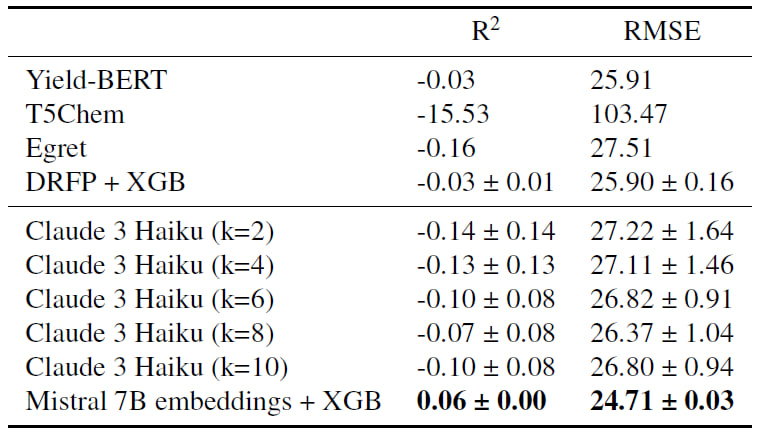
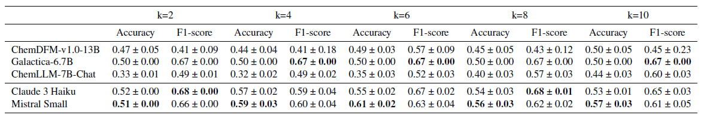

# Rebuttal

Here we provide the results of additional experiments requested by reviewers.

## How well do LLMs perform in predicting precise yield values?

In addition to our regression experiments provided in Appendix A.1, we tested LLMs performance in predicting precise yield values on the USPTO-R dataset across two settings:

1) We selected Claude 3 Haiku as one of the best performing models and asked it to predict reaction yields in a few-shot approach with the following system prompt:

*You are an expert chemist. Based on text descriptions of organic reactions your task is to predict their yields using your experienced reaction yield prediction knowledge. You will be provided with several examples of reactions and corresponding yields measured in %. Based on these examples, predict the yield of the given reaction. Please, answer with only one float number, do not write anything else.*

2) We selected Mistral 7B embeddings as the best performing ones for the USPTO-R dataset and employed grid-serach to find the optimal hyperparameters of the XGBRegressor model.

The comparison of obtained results with baselines is provided below:

**Conclusion:**

The difficulty of precise reaction yield prediction is confirmed by modest performance of all compared models.
However, we would like to highlight that Mistral 7B embeddings achieve best performance among other approaches, which again emphasizes the ability of LLM embeddings to become novel SOTA reaction representations.

## How chemical LLMs compare to generalist LLMs?

To compare chemical LLMs directly with generalist LLMs in the few-shot setting, we conducted additional **few-shot experiments with chemical LLMs** on the USPTO-R dataset. 
Note: Despite changes in prompts and model configuration, Galactica-6.7B consistently responded with the same yield category, producing the same metrcis across all k values.
The results are provided below:

**Conclusion:**

It can be observed that in the few-shot setting generalist LLMs still outperform chemical LLMs in most cases. The best accuracy=0.61 achieved by Mistral Small (k=6) is 11% higher than the best result achieved by chemical LLMs (accuracy=0.5 by Galactica-6.7B). Also, results of chemical LLMs in few-shot setting (represented in Table 2 of the main text) are comparable with few-shot results, which demonstrates the appropriateness of initial experimental design.